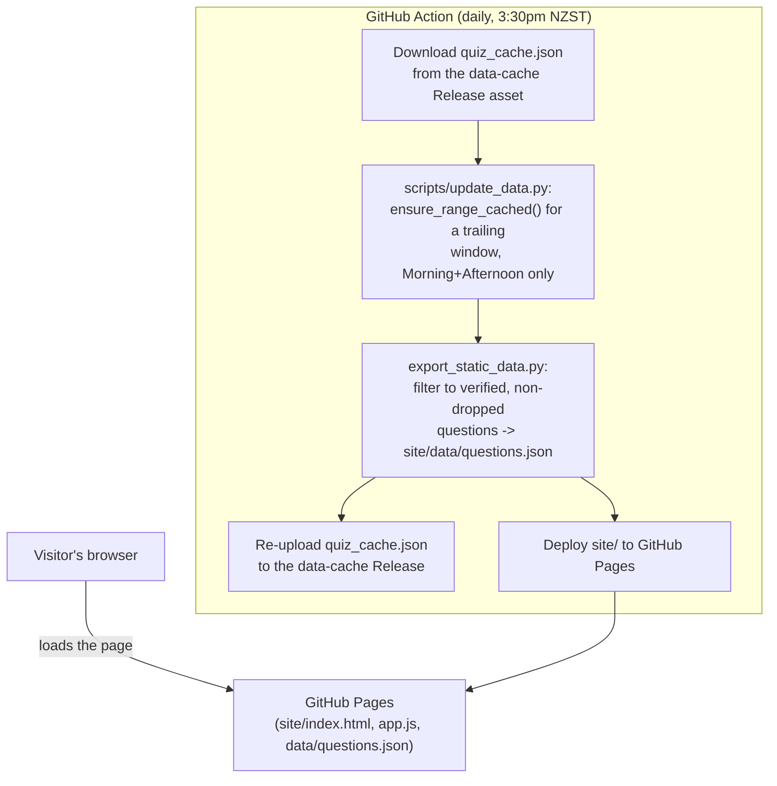

# Stuff Quiz Knowledge Conquest

A small static site that generates a custom trivia quiz from Stuff.co.nz's
daily quizzes. Pick a date range, how many questions you want, and which
quiz types to draw from (Morning / Afternoon Trivia) — it randomly samples
questions from that pool and runs an interactive quiz with scoring. The
quiz-taking screen is styled to match riddle.com's own quiz player (colors,
fonts, the correct/wrong reveal pills, per-question header photos, and the
image fade-in transition) — see "How it works" below.

The site itself (`site/`) is fully static and hosted on **GitHub Pages** —
there's no backend serving requests. A GitHub Action runs on a daily
schedule to scrape/verify newly published quizzes and republish the data
file the page loads; the browser does all the date/series filtering and
question sampling client-side. See "Architecture" below for how the pieces
fit together.

> Kids Trivia was dropped as a feature (previously offered alongside
> Morning/Afternoon) — see "Known limitations".

## How it works

1. **Discovery** — [Wayback Machine CDX](https://web.archive.org/cdx/search/cdx)
   is used to find Stuff quiz article IDs published in a given date range
   (Stuff's own site only exposes the ~50 most recent items per topic).
2. **Content** — each article's questions/options come from Stuff's public
   `https://www.stuff.co.nz/api/v1.0/stuff/story/<id>` API, which includes a
   no-JS HTML fallback of the embedded Riddle.com quiz widget.
3. **Answer verification** — Riddle's static data deliberately withholds
   the correct answer (it's revealed client-side only after answering), and
   naive heuristics based on the raw option order turned out to sometimes be
   **wrong** (see `riddle_verify.py`'s docstring for a concrete example).
   So every question's correct answer is confirmed by actually playing
   through the live quiz once in headless Chromium (Playwright) and reading
   the "Correct answer" tag Riddle shows after answering. This is slow
   (~1–3s per question) but the result is cached forever, and the app only
   ever serves questions that have been verified this way.
4. **Images** — each question in a Riddle quiz has its own header photo,
   served from `cdn.riddle.com` with no auth/referrer restrictions (so it
   can be hotlinked directly). These aren't exposed by Stuff's plain story
   API, so `riddle_verify.py` captures each question's image URL during the
   same headless-browser playthrough used for answer verification. The
   frontend preloads the *next* question's image while the current one is
   still on screen (see `site/app.js`), so by the time you click "Next"
   it's normally already cached and fades in immediately — matching
   riddle.com's own `opacity 0.5s ease-out` reveal instead of trailing a
   live fetch. Questions without a captured image yet fall back to a plain
   gradient banner rather than showing nothing.
5. Everything scraped/verified is kept in a working cache
   (`cache/quiz_cache.json`) so repeat scrapes for an overlapping date range
   are instant. A filtered, flattened snapshot of just the verified
   Morning/Afternoon questions is what the static site actually serves —
   see "Architecture".

## Architecture

There's no server handling quiz requests. A scheduled GitHub Action
scrapes/verifies new quizzes and republishes a static data file; the page
itself just fetches that file and does all filtering/sampling in the
browser.



The git repo only ever holds source code. The large/mutable working cache
(raw scrape state, including any not-yet-verified questions) is **not**
committed — it's persisted as a **GitHub Release asset** (tag `data-cache`),
downloaded at the start of each workflow run and re-uploaded at the end. The
derived `site/data/questions.json` the page actually fetches is generated
fresh every run and deployed straight to Pages — also never committed to
git. This keeps the repo itself small no matter how much history accumulates.

### One-time GitHub-side setup

These aren't automated (need repo admin/push access):

1. **Seed the `data-cache` release** with an initial working cache, so the
   first scheduled run doesn't have to rebuild everything from scratch:
   ```bash
   gh release create data-cache cache/quiz_cache.json \
     -R <owner>/<repo> \
     --title "Working scrape cache (do not use directly)" \
     --notes "Internal cache for quiz_scraper.py — see README."
   ```
   (If skipped, the workflow creates an empty one on its first run and
   backfills gradually via its own trailing scrape window.)
2. **Enable GitHub Pages with source = GitHub Actions:**
   ```bash
   gh api -X PUT repos/<owner>/<repo>/pages -f build_type=workflow
   ```
   or manually via Settings → Pages → Build and deployment → Source.

After that, [.github/workflows/update-and-deploy.yml](.github/workflows/update-and-deploy.yml)
handles everything else on its own schedule (`workflow_dispatch` also
available for a manual run).

## Local development

There's no backend to run locally anymore — just Python scripts that touch
the working cache, and the static site itself.

```bash
python3 -m venv venv
source venv/bin/activate
pip install -r requirements.txt
python -m playwright install chromium
```

**Preview the site** against your local cache (regenerates
`site/data/questions.json` from whatever's currently in
`cache/quiz_cache.json`, then serves `site/` as-is):

```bash
python scripts/export_static_data.py
python -m http.server 8000 -d site
```

Then open http://127.0.0.1:8000. Re-run `export_static_data.py` any time
your cache changes and refresh the page to pick it up.

**Grow/refresh the cache for a date range** (the same thing the daily
GitHub Action does, but for whatever range you want — e.g. to backfill
weeks the Action hasn't gotten to yet, or right after a code change to
`quiz_scraper.py`/`riddle_verify.py` you want to test):

```bash
python scripts/update_data.py --start-date 2026-01-01 --end-date 2026-01-31
```

This fetches + ground-truth-verifies any not-yet-cached quizzes in that
range and re-exports `site/data/questions.json` when it's done. Omit the
dates to use the default trailing-N-days window (`--window-days`, default
7) instead — this is also what the CI workflow calls with no arguments.

If `cache/quiz_cache.json` doesn't exist yet at all, it's seeded from
`../stuff_quizzes.json` (the output of the standalone
`scrape_stuff_quizzes.py` script one level up), if present.

## Re-verifying / backfilling the cache offline

To pre-warm/backfill the *entire* local working cache instead of targeting
a specific date range:

```bash
python verify_cache.py --workers 8
```

This verifies any quiz in the cache that isn't fully verified yet (safe to
re-run; already-verified quizzes are skipped unless you pass `--force`).

To backfill images onto questions that were answer-verified *before* image
capture existed (skips the "Correct answer" reveal-wait, so it's noticeably
faster than a full re-verify):

```bash
python verify_cache.py --images-only --workers 8
```

Image capture in particular is best-effort per playthrough (see "Known
limitations"), so re-running `--images-only` a few times tends to keep
picking up stragglers it missed the first time.

**Don't run `verify_cache.py` and `scripts/update_data.py` against the same
cache file at the same time** — they both independently load/save
`cache/quiz_cache.json`, and whichever finishes saving last will clobber
the other's progress.

## Files

| File | Purpose |
|---|---|
| `quiz_scraper.py` | Discovery (Wayback CDX) + content fetch (Stuff API) + caching |
| `riddle_verify.py` | Headless-browser ground-truth answer verification + image capture |
| `verify_cache.py` | CLI to batch-verify/backfill the whole cache in parallel |
| `scripts/update_data.py` | Scrape/verify a date range (explicit, or a trailing window by default), then export |
| `scripts/export_static_data.py` | Filters the working cache down to verified questions -> `site/data/questions.json` |
| `.github/workflows/update-and-deploy.yml` | Scheduled Action: run `update_data.py`, deploy `site/` to Pages |
| `site/` | The static site (HTML/CSS/vanilla JS + generated `data/questions.json`) |
| `cache/quiz_cache.json` | Working cache of scraped + verified quizzes (gitignored — lives in the `data-cache` Release asset) |

## Known limitations

- **Kids Trivia was dropped as a feature entirely**, not just hidden — it's
  no longer in `quiz_scraper.PICKLIST`, and `scripts/update_data.py` never
  discovers/scrapes it going forward (it passes `series_keys=["morning",
  "afternoon"]` into `ensure_range_cached`). `export_static_data.py` also
  defensively excludes it from `site/data/questions.json` in case any stale
  entries remain in the working cache.
- A small number of quizzes mix multiple-choice questions with free-text
  "TextEntry" blocks (e.g. some Weekender Trivia editions). The verifier
  only knows how to play through radio-button questions, so a TextEntry
  block partway through a quiz can cause the remaining questions in that
  quiz to be skipped (marked unverified, and excluded from the app's
  question pool) rather than mis-verified.
- Image capture is separately best-effort: a playthrough can be interrupted
  by an interstitial ad screen or similar UI transition before it reaches
  every question, so coverage fills in gradually across repeated
  `--images-only` runs rather than hitting 100% on the first pass.
- A tiny fraction of quizzes use a non-standard/visual format (e.g.
  image-matching) with no text fallback at all and are skipped entirely.
- Per Stuff's `robots.txt`, several AI-crawler user agents (including
  ClaudeBot) are disallowed site-wide. This app doesn't identify as any of
  those, but keep usage personal/low-volume out of respect for that stated
  preference.

## Goals / roadmap

- **Bring back Weekender Trivia.** It's deliberately left out of the
  picklist for now (see `quiz_scraper.PICKLIST`) because its editions mix in
  free-text "TextEntry" blocks that the verifier can't play through, which
  currently aborts verification for the rest of that quiz too. Making the
  verifier skip a lone TextEntry block and keep going (rather than bailing
  out) would let Weekender come back with good coverage.
- **Expose the other quiz series the scraper already recognizes.**
  `SERIES_RULES` in `quiz_scraper.py` already tags "The Hard Word", "Really
  Hard Word", and "News Quiz" — and single-option Hard Word questions are
  already auto-verified with no browser needed (see `verify_cache.verify_one`)
  — but none of them are in `PICKLIST` yet, so they're never offered as a
  selectable quiz type in the UI.
- **Improve image-capture coverage** beyond the current best-effort
  playthrough, e.g. by making `_advance_to_new_question` more robust to
  whatever interstitial/ad-transition states are causing playthroughs to
  stop partway through a quiz.
- **Handle non-standard visual quiz formats** (e.g. image-matching) instead
  of skipping them outright, if a text-based fallback can be found.
